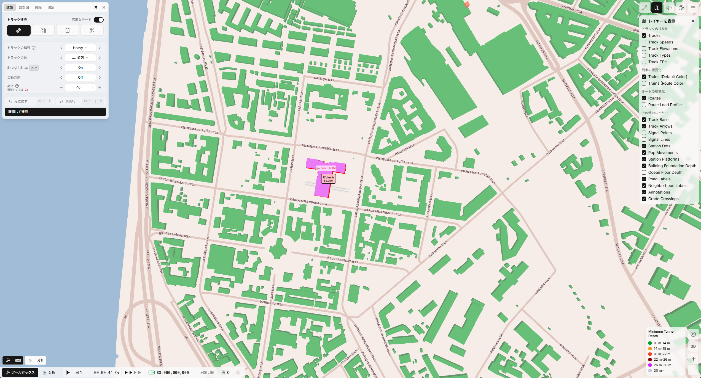
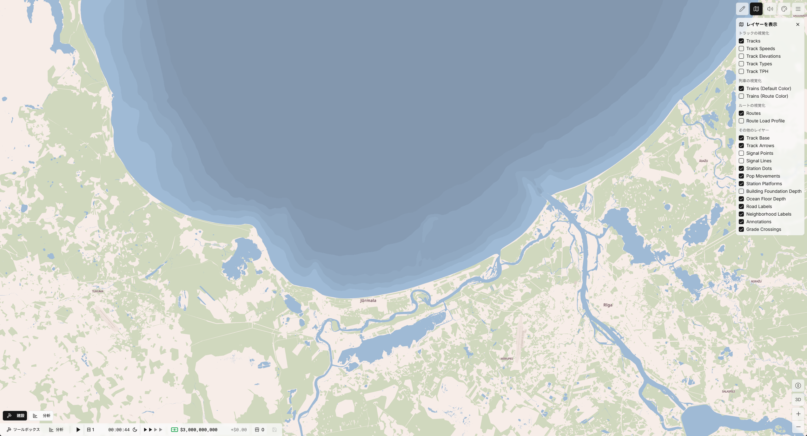

# subwaybuilder-eu-maps

## Summary

Each map covers the metropolitan area around one or more major European cities. Metropolitan-area bounds are drawn from national cadastral or statistical-office boundary products; municipal-level population, employment, and commute data drive resident and worker placement below the municipality scale wherever the source data allows it.

## Features

- High level of detail, with sub-municipality population placement driven by country-specific rasters or settlement-unit grids.
- Spatial realism -- points are assigned in a manner that is aware of water features, administrative boundaries, and density-weighted placement surfaces.
- Special demand from several country-specific open-data sources is modeled — covering airports, ports, universities, hospitals, military installations, sports venues, cultural attractions, museums, libraries, and tourism sites. See [Special Demand Details](#special-demand-details) below for the per-country category breakdown.
- Buildings are sourced from each country's national cadastre (RÚIAN for Czechia, BDOT10k for Poland, EHR + ETAK for Estonia). OSRM routing data is shared with the broader Subway Builder map pipeline.
- Building foundation depth (the clearance a subway tunnel needs to pass beneath a building) is modeled per building from its height and footprint width, starting with the Estonian bundles (0.3.3); bundles not yet re-exported use a flat default. Train-related infrastructure is exempt.

## High-Level Methodology

Resident and commuter totals are estimated from country-specific census and employment tables, then distributed spatially using the best available mesh or raster guidance for each country. Population counts are conserved at municipality-level control totals, while workplace-side calibration and commute matrices keep resident and worker demand in balance.

A gravity model augmented with observed municipality-to-municipality commute flows reproduces macro-level commute patterns when sub-municipal O/D pairs are not directly published.

#### Czech Republic

Czech bundles combine CZSO Census 2021 population and economic-activity tables with the EU JRC GHS-POP 2020 100m raster for within-municipality population weighting. For distributing jobs, a separate 100m raster layer built from Overture building volumes (and weighed by industry type) is constructed against the DojizdkovyProud workplace-side totals. Administrative boundaries come from RUIAN (the Czech cadastral registry). For resident-worker flows, the CZSO 2021 commute O/D matrix at sub-municipal (ZSJ-díl) granularity is used to provide macro-level flow, with randomization used to assign individual populations for each ZSJ-díl pair to points within their respective boundaries.

In addition, because the 2021 census was conducted during COVID, its published commute matrix inflates same-settlement (and therefore ZSJ-díl) self-commute flows well above pre-pandemic levels. A gravity-based correction pass redistributes the excess self-commute volume into cross-settlement flows. The parameters of the gravity model are calibrated per bundle, using the known log-normal commute-distance distribution from the CZSO 2021 commute O/D matrix. This correction pass brings aggregate self-commute back to plausible pre-pandemic levels without distorting the observed inter-settlement flow structure.

#### Poland

Polish bundles combine GUS NSP 2021 census tables (population at 1km / 250m / 125m hybrid resolution; per-rejon population from the 16-sheet voivodship workbook) with the GUGiK BDOT10k national buildings cadastre for within-municipality population and worker weighting. The metropolitan-area boundary unit is the FUA (Funkcjonalny Obszar Miejski), defined by the Eurostat URAU 2021 layer, with each FUA dissolved from member gmina polygons via the GUGiK PRG cadastral registry.

The sub-municipal base unit of population/worker modeling is the **BREC rejon statystyczny** (35,774 nationwide), GUS's official statistical enumeration area — the direct analog to the Czech ZSJ-díl. Per-rejon worker mass is derived from BDOT10k floor area weighted by `kodKst` (the Polish building-function classification; 9 worker classes), with per-bundle weights calibrated by NNLS fit against BDL PKD employment counts. Gmina-level `pracujący` (BDL) is the column-margin truth for worker totals.

Two PL-specific calibration corrections augment the JP-style municipal-weighted gravity model. First, GUS strips intra-gmina commute flows at NSP 2021 publication. A **deterministic self-loop reconstruction** pass per gmina restores the diagonal as `BDL[g] − Σ inbound[g]`, recovering the intra-gmina worker mass that the model would otherwise lose.

#### Estonia

Estonian bundles combine the 2021 Estonian census per-municipality and per-asustusüksus tables with Statistikaamet's INSPIRE-aligned 100 m / 250 m population grid for within-municipality population weighting. Workplace mass is derived from the Ehitisregister national building cache filtered through the three-tier KAOS use-code taxonomy (residential / workplace / mixed-use), with per-firm employee totals from Estonian Commercial Register annual reports providing the workplace anchor. Administrative boundaries come from the EHAK (Eesti haldus- ja asustusjaotuse klassifikaator) registry; the five largest cities — Tallinn, Tartu, Pärnu, Narva, Kohtla-Järve — are further subdivided into asum / kvartal / linnaosa neighborhoods via Maa-amet's official sub-municipal boundary layer (Tallinn 92 polygons, Tartu 51, Pärnu 22, Narva 19, Kohtla-Järve 5).

Commute flows are calibrated against the 2021 census commute matrix, which publishes only bin-marginal shares (within-municipality, within-county, cross-county, against Tallinn, against Tartu) rather than a full municipality × municipality cell matrix. A Generalized IPF pass with destination-pinning on the two anchor cities reconciles a gravity-decay model against those bin marginals; a symmetric containment-share guard prevents over-routing to the urban core when the decay would otherwise concentrate flows on Tallinn / Tartu.

#### Latvia

Latvian bundles combine the 2021 Latvian census (_Tautskaite 2021_) per-LGU (Local Government Unit) and per-_pagasts_ (rural sub-municipal unit) tables with CSP's native hybrid population grid — 100 m across densely populated areas and _Blīvi apdzīvotās teritorijas_ (DPA) settlement clusters, and 1 km across rural areas — for within-municipality population weighting. Workplace mass is derived from the VZD INSPIRE Buildings national cache filtered through the 10-code INSPIRE `CurrentUseValue` taxonomy (residential filter + address-derived apartment unit-count cascade), with per-LGU workplace census totals and their NACE Rev 2 economic-activity breakdown providing the workplace anchor. Administrative boundaries come from the post-2021 42-LGU polygons published by VZD (35 _novadi_ + 7 _valstspilsētas_); the ATVK classifier defines LGU / pagasts / apkaime codes and the NUTS-3 crosswalk. Rīga is further subdivided into its 58 official _apkaime_ sub-city neighborhoods via the Rīgas dome open-data boundary set, and 131 pure-workplace anchor polygons — major industrial estates, office parks, port complexes, and airport employment zones — are carved out of the DPA layer as their own sub-municipal units.

Commute flows are calibrated against the 2021 census commute matrix at three grains — NUTS-3 region × region (5×5), 42 LGU × 42 LGU, and sub-LGU pagasts × all workplaces — reconciled via a hierarchical gravity model with distance-decay. Symmetric cordon snapping at LGU boundaries preserves cross-bundle commute flow where the closed-matrix boundary would otherwise collapse it onto the boundary LGU's self-loop.

#### Ukraine

Ukrainian bundles run into two open-data gaps that the other European bundles do not. Ukraine does not publish a national buildings cadastre, and the state statistics service does not publish a sub-oblast commute matrix. Where Czechia, Poland, Estonia, and Latvia each start from a national cadastre with per-building use codes, Ukrainian building geometry is drawn from the Overture Maps Europe extract with heights back-filled by JRC's Global Building Attribute (GBA) LoD1 rasters. Because Overture's class-tag coverage on Ukrainian territory is uniformly sparse, a bespoke seven-tier per-building classifier assigns each footprint to a residential, workplace, or inert class using a cascade of signals: JRC GHS OBAT per-polygon use-code hints where present, OpenStreetMap sub-tags for civic / school / hospital / religious / military buildings, OSM landuse-polygon context, the JRC GHS GULU 10 m urban land-use raster (voted 5×5 at 100 m to denoise 10 m road pixels), and per-building morphology (footprint × height × implied floor count). An operator-curated polygon-override set handles the tail — industrial estates that would otherwise misclassify as apartments, and OSM polygons tagged as `brownfield` or `military` only after the 2022 full-scale invasion, which on satellite spot-check turn out to be war-damage tagging of pre-war residential fabric rather than pre-existing brownfield.

A significant portion of the classifier work is a five-rule polygon-matching cascade between JRC GHS OBAT and Overture. The two data sources publish overlapping footprints for the same building at slightly different centroids and sizes, which naively would double-count floor area or drop a match when the OBAT centroid lands outside the Overture polygon under a concave shape. The rescue cascade estimates a per-tile centroid-offset field, applies an offset-corrected snap, resolves multi-OBAT contention with an operator-visible review queue for the harder cases, dedupes twin polygons and OSM relation-outer envelopes, and synthesizes anchor points for large-footprint buildings that OBAT missed. Per-value provenance is preserved end-to-end so any classification can be audited back to its constituent source signals.

Residential population is anchored to Держстат's pre-invasion _наявне населення_ (present population) per _hromada_ (the post-2020 KATOTTH-reform sub-municipal unit), split down to individual settlements using 2001 All-Ukrainian Census relative weights. Within each _hromada_, per-cell residential distribution is built bottom-up from the classified buildings' floor area — the JRC GHS-POP 100 m raster serves only as a last-resort rescue for rural _hromada_-fragments where the building signal is sparse, not as the primary distribution as it does in other GHS-only countries. Workplace mass is derived synthetically per _hromada_ from Робоча сила's per-oblast Зайняте (employed population) rate applied to each _hromada_'s working-age share, then distributed spatially across the classified buildings using a per-oblast NACE-sector anchor from Держстат's workplace-employee register. Sub-oblast headcount is statutorily confidential in Ukraine (the Symbol к rule), so the per-hromada workforce total is a synthetic derivation rather than a direct read; the spatial distribution within it is the classified-buildings signal.

The seven metropolitan bundles — Kyiv, Kharkiv, Lviv, Odesa, Dnipro, Zaporizhzhia, Kryvyi Rih — carry sub-hromada _raion_ grain for their central _hromada_, with city-district polygons drawn from OpenStreetMap administrative-level-10 boundaries; satellite \_hromada_s stay at hromada grain. Commute calibration is where the second data gap surfaces: because Ukraine does not publish a sub-oblast commute O/D matrix, a **synthetic generalized-IPF** closure over per-region self-loop / same-raion / cross-raion bin marginals anchors a gravity-decay model. The bin-marginal priors are derived from cohort statistics of Poland (2021 gmina O/D), Japan (2020 municipality O/D), and Taiwan (2020 township O/D) at matched urbanity × population × density cells. A cordon-aware boundary-dilution penalty on boundary-hromada self-shares corrects for the fact that the cohort statistics come from bundles with open commuting across their bundle edges; the dilution shape is calibrated against Poland's symmetric-cordon recovery pattern to prevent Ukrainian boundary hromadas from inheriting inflated self-loop marginals.

Special-demand points — airports, ports, universities, and a curated attractions roster covering museums, cultural centres, theatres, churches, parks, beaches, theme parks, aquariums, zoos, and National Reserves — all cite pre-February-2022 vintages by policy: 2019 for aviation and port throughput (pre-COVID plus pre-invasion peaks), 2021 for university enrollment, and pre-2022 sources for attraction visitor counts. Every attraction row in the curated roster carries a per-value provenance citation: the source publication or the press-grounded estimate method, plus an explicit uncertainty tag (sourced vs. estimate; low / moderate / high). The roster reconciles against Ukrstat's 2017 cultural-institution bulletin (per-region museum, theatre, and concert-organization visitor counts) — with a scope correction because Ukrstat's museum table covers state museums but not National Reserves like Kyiv-Pechersk Lavra, Sofia of Kyiv, Khortytsia, and Pyrohiv, which each carry substantial pre-war visitor traffic and are curated separately.

Geographic exclusions are enforced at the data-file level for every consumed source, regardless of whether the source publication includes the excluded territories: Crimea and Sevastopol (occupied since 2014), and the portions of Donetsk and Luhansk oblasts east of the pre-2022 contact line (controlled by separatist authorities since 2014). Territories that were under Ukrainian government control pre-February 2022 remain policy-eligible even where they have since been captured or destroyed — Mariupol, Bakhmut, Avdiivka, and similar. Kherson, occupied February-November 2022 and since liberated, is policy-eligible and included where source data exists.

### Future countries

Additional European countries will be added as country-specific open-data pipelines come online. Each country follows the same conservation-and-calibration scheme above, with country-specific inputs substituted for boundaries, population, employment, commute matrices, and special-demand layers.

## Primary Data Sources

#### Shared (across all European bundles)

- **Road Network & Land Cover Fallback** (road network, areal roads, and residual land-cover polygons for classes not covered by each country's national land-use registry) — [OpenStreetMap](https://www.openstreetmap.org/)
- **Auxiliary Building Footprints** (side-channel for the 3D building tiles and ocean-mask polygons where cadastre coverage is incomplete) — [Overture Maps Foundation](https://overturemaps.org/)
- **Coastal Bathymetry** (DTM at ~115 m resolution across the Baltic Sea, powering the coastal seafloor-depth layer for coastal bundles) — [EMODnet Bathymetry](https://emodnet.ec.europa.eu/en/bathymetry)
- **Routing Network** (OSRM routing shared with the broader Subway Builder map pipeline) — [OSRM Project](http://project-osrm.org/)

#### Czech Republic

- **2021 Census** (_Sčítání lidu, domů a bytů 2021_ / SLDB 2021 — per-municipality and per-ZSJ-díl population, employment, economic activity) — [ČSÚ / CZSO](https://www.czso.cz/)
- **Commute O/D Matrix** (ČSÚ DojizdkovyProud 2021 — sub-municipal residence × workplace commuter flows and workplace-side occupied-jobs tables) — [ČSÚ / CZSO](https://www.czso.cz/)
- **Administrative Boundaries** (RUIAN _obec_ + ZSJ-díl polygons; national cadastral registry) — [ČÚZK](https://www.cuzk.cz/)
- **Building Polygons & Use Classification** (RUIAN _StavebniObjekt_ with per-building footprint, floor count, and use classification, refined by ZABAGED® building-type tags — the sole building source for both modeled demand and the 3D building tiles) — [ČÚZK](https://www.cuzk.cz/)
- **Land-Cover Polygons** (ZABAGED® Polohopis — parks, cemeteries, forests, grasslands, aerodromes) — [ČÚZK](https://www.cuzk.cz/)
- **100 m Population Grid** (GHS-POP R2023A / 2020 epoch — 100 m population raster for within-municipality weighting) — [JRC / EU Copernicus](https://ghsl.jrc.ec.europa.eu/)
- **University Enrollment** (MŠMT DSIA F21 — per-institution higher-education student headcount) — [MŠMT](https://dsia.msmt.cz/)
- **Airport Passenger Statistics** (terminal-level annual passengers) — [ÚCL / Czech CAA](https://www.caa.cz/statistiky)
- **Tourism Visitor Statistics** (krajské attraction visitor statistics) — [tourdata.cz](https://tourdata.cz/)
- **Library & Theatre Attendance** (NIPOS Statistika kultury per-branch library visitor counts and per-season theatre attendance) — [NIPOS](https://www.statistikakultury.cz/)
- **Sports League Attendance** (Chance Liga football, Tipsport Extraliga ice hockey) — [chanceliga.cz](https://www.chanceliga.cz/statistiky-rekordy) · [hokej.cz](https://www.hokej.cz/)
- **Hospital Registry & Bed Statistics** (ÚZIS Lůžkový fond per-facility bed counts and occupancy; NRPZS provider register for facility addresses) — [ÚZIS ČR](https://www.uzis.cz/)
- **Military Installations** (AČR garrison roster — active-duty personnel curated from official unit references and public sources)

#### Poland

- **2021 Census** (_Narodowy Spis Powszechny Ludności i Mieszkań 2021_ / NSP 2021 — per-municipality and per-rejon population, employment, and demographics) — [GUS / Statistics Poland](https://stat.gov.pl/)
- **Workplace Employment Statistics** (GUS NSP 2021 _pracujący_ ILO-style residence-side measure; GUS BDL sector-broken workplace statistics with PKD-section breakdown P4457) — [GUS NSP 2021](https://stat.gov.pl/) · [GUS BDL](https://bdl.stat.gov.pl/)
- **Administrative Boundaries** (PRG _Państwowy Rejestr Granic_ — gminy + powiaty + województwa) — [GUGiK](https://www.gugik.gov.pl/)
- **BREC Rejon Polygons** (_rejon statystyczny / obwód spisowy_ census units + per-rejon populations) — [GUS INSPIRE](https://geo.stat.gov.pl/)
- **Building Polygons & Use Classification** (BDOT10k — per-building footprint with PKOB → kodKst classification and floor count) — [GUGiK](https://www.geoportal.gov.pl/)
- **Address Geocoding** (GUGiK CAPAP national address geocoder) — [GUGiK CAPAP](https://www.gugik.gov.pl/)
- **Functional Urban Area Boundaries** (Eurostat URAU FUA polygons, gmina-aggregated) — [Eurostat GISCO](https://ec.europa.eu/eurostat/web/gisco)
- **100 m Population Grid** (GHS-POP R2023A / 2020 epoch) — [JRC / EU Copernicus](https://ghsl.jrc.ec.europa.eu/)
- **Sub-Gmina Travel-Behaviour Surveys** (Warsaw Badanie Ruchu 2015 and Wrocław Kompleksowe Badanie Ruchu 2018, driving the optional rejon-level workplace prior and rejon × rejon OD overlay) — [Warsaw](https://transport.um.warszawa.pl/) · [Wrocław](https://www.wroclaw.pl/)
- **Airport Passenger Statistics** (terminal-level annual passengers) — [ULC / Urząd Lotnictwa Cywilnego](https://ulc.gov.pl/pl/statystyki-analizy)
- **Passenger-Ferry Terminal Statistics** (per-port annual passenger throughput — coastal bundles) — [Actia Forum Port Monitor](https://www.actiaforum.pl/)
- **University Registry** (POL-on RADON institutional metadata) — [POL-on RADON](https://radon.nauka.gov.pl/)
- **University Enrollment** (GUS per-institution higher-education student headcount) — [GUS Higher Education](https://stat.gov.pl/obszary-tematyczne/edukacja/)
- **Tourism Visitor Statistics** (POT annual _Frekwencja w atrakcjach turystycznych_ ~960-attraction roll-up) — [Polska Organizacja Turystyczna](https://www.pot.gov.pl/)
- **Convention & Exhibition Centers** (PIPT-tracked venues) — [Polska Izba Przemysłu Targowego](https://www.pipt.pl/)
- **Theatre Attendance** (per-season Instytut Teatralny statistics) — [e-teatr.pl](https://www.e-teatr.pl/)
- **Sports League Attendance** (Ekstraklasa football, Tauron Hokej Liga ice hockey, PlusLiga volleyball, ORLEN Superliga handball) — [ekstraklasa.org](https://www.ekstraklasa.org/) · [phl.pl](https://www.phl.pl/) · [plusliga.pl](https://www.plusliga.pl/) · [pgnig-superliga.pl](https://www.pgnig-superliga.pl/)
- **Hospital Registry & Bed Statistics** (RPWDL medical-entity registry for facility addresses; GUS BDL health-sector bed-occupancy and outpatient rates) — [dane.gov.pl](https://dane.gov.pl/) · [GUS BDL](https://bdl.stat.gov.pl/)
- **Military Installations** (Polish Armed Forces garrison roster — active-duty personnel curated from official unit references and public sources)

#### Estonia

- **2021 Census** (_Eesti rahvaloendus 2021_ / REL 2021 — per-municipality and per-asustusüksus population, employment, and demographics) — [Statistikaamet / Statistics Estonia](https://www.stat.ee/)
- **INSPIRE Population Grid** (RR21 — 100 m and 250 m gridded population, INSPIRE-aligned in EPSG:3035; Eurostat epoch alignment) — [Statistikaamet](https://www.stat.ee/) · [Eurostat GISCO](https://ec.europa.eu/eurostat/web/gisco)
- **Commute O/D Matrix** (RL21163 — residence × workplace bin-marginal shares: own-KOV / same-maakond / cross-maakond / Tallinn / Tartu) — [Statistikaamet](https://www.stat.ee/)
- **Workplace Employment Statistics** (RL21166 employed-residents by EMTAK economic activity; per-firm employee counts from Eesti Ametlik Ariregister annual reports) — [Statistikaamet](https://www.stat.ee/) · [Äriregister](https://ariregister.rik.ee/)
- **Administrative Boundaries** (EHAK _Eesti haldus- ja asustusjaotuse klassifikaator_ — omavalitsus + maakond + asustusüksus polygons) — [Statistikaamet EHAK](https://www.stat.ee/en/find-statistics/methodology/classifications/ehak)
- **Building Registry** (Ehitisregister — national building cache with per-building KAOS use codes, floor counts, footprints, and unit counts) — [Eesti Ehitisregister](https://www.ehr.ee/)
- **Topographic Polygons** (ETAK — Eesti Topograafiline Andmekogu — building footprints, land-use, water, and transport ROW polygons; KAOS use-code taxonomy; annual cadastral snapshot with siht1 zoning) — [Maa-amet](https://geoportaal.maaamet.ee/)
- **Address Geocoding** (ADS — Aadressiandmete süsteem — Maa-amet's authoritative geocoding service) — [Maa-amet ADS](https://aadressid.maaamet.ee/)
- **Sub-KOV Subdivisions** (AKS Mitteametlikud piirkonnad — asum / kvartal / linnaosa boundaries for the five largest cities: Tallinn 92, Tartu 51, Pärnu 22, Narva 19, Kohtla-Järve 5) — [Maa-amet](https://geoportaal.maaamet.ee/)
- **Airport Passenger Statistics** (terminal-level annual passengers) — [Tallinna Lennujaam / Tallinn Airport](https://www.tallinn-airport.ee/)
- **Passenger-Ferry Terminal Statistics** (per-port throughput at Old City Harbour, Paldiski North / South, Paljassaare, plus the regional ports at Rohuküla, Sillamäe, and Saaremaa) — [Tallinna Sadam / Port of Tallinn](https://www.ts.ee/) · [Statistikaamet](https://www.stat.ee/)
- **University Registry & Enrollment** (EHIS / _Eesti Hariduse Infosüsteem_ — institutional metadata + per-institution enrollment for universities, junior colleges, and technical colleges) — [HTM / EHIS](https://www.haridussilm.ee/)
- **Tourism Visitor Statistics** (Statistikaamet TUR042 + per-site operator reports) — [Statistikaamet TUR042](https://www.stat.ee/) · [Visit Estonia](https://www.visitestonia.com/)
- **Hospital Registry & Bed Statistics** (Terviseamet facility registry + per-facility bed counts) — [Terviseamet](https://www.terviseamet.ee/)
- **Military Installations** (Kaitsevägi garrison roster — active-duty personnel curated from official unit references) — [Kaitsevägi](https://mil.ee/)

#### Latvia

- **2021 Census** (_Tautskaite 2021_ — per-LGU, per-pagasts, and per-apkaime population and employment) — [CSP / Statistics Latvia](https://stat.gov.lv/)
- **Native Census Grid** (CSP _teritorijas statistikas dati_ — 1 km rural + 100 m urban / DPA cell polygons with per-cell population × sex × age) — [CSP](https://stat.gov.lv/)
- **Workplace Employment Statistics** (CSP workplace census tables at LGU grain with NACE Rev 2 economic-activity breakdown; annual residence-side and workplace-side marginals) — [CSP PxWeb](https://data.stat.gov.lv/)
- **Commute O/D Matrix** (CSP commute matrix at three grains — NUTS-3 region × region, LGU × LGU, sub-LGU pagasts × all workplaces) — [CSP PxWeb](https://data.stat.gov.lv/)
- **Population by Territorial Grain** (annual 2000–2025 population × sex × age at region, LGU, pagasts, DPA, city, town, village, apkaime) — [CSP PxWeb](https://data.stat.gov.lv/)
- **Administrative Boundaries** (VZD post-2021 42-LGU polygons — 35 _novadi_ + 7 _valstspilsētas_) — [VZD / State Land Service](https://data.gov.lv/dati/lv/dataset/atr)
- **ATVK Classifier** (_Administratīvo teritoriju un teritoriālo vienību klasifikators_ — 7-digit codes for LGUs, 512 pagasti, apkaimes, and NUTS-3 crosswalk) — [CSP ATVK](https://data.gov.lv/dati/lv/dataset/atvk)
- **Building Polygons & Use Classification** (VZD INSPIRE Buildings national cache with 10-code `CurrentUseValue` classifications, floor counts, and footprints — the sole building source for both modeled demand and the 3D building tiles) — [VZD INSPIRE](https://data.gov.lv/dati/lv/dataset/ekas-inspire)
- **Address Geocoding** (VZD INSPIRE Addresses — authoritative geocoder for institutional locations) — [VZD INSPIRE](https://data.gov.lv/dati/lv/dataset/adreses-inspire)
- **Densely Populated Areas** (_Blīvi apdzīvotās teritorijas_ / DPA — CSP settlement-cluster polygons per EU Regulation 2017/543, including 131 pure-workplace anchor clusters) — [CSP via data.gov.lv](https://data.gov.lv/)
- **Rīga Sub-City Boundaries** (_apkaime_ polygons — Rīga City's official 58 sub-city subdivisions) — [Rīgas dome](https://data.gov.lv/)
- **Forest Register** (VMD _Meža valsts reģistra meža dati_ — per-stand forest polygons at 1:10 000 topographic scale) — [VMD / State Forest Service](https://data.gov.lv/dati/lv/dataset/meza-valsts-registra-meza-dati)
- **Agricultural Parcels** (LAD _Lauku reģistra dati_ — LPIS field blocks and per-parcel crop declarations) — [LAD / Rural Support Service](https://www.lad.gov.lv/lv/lauku-registra-dati)
- **Hydrography** (LGIA INSPIRE hydrography — inland rivers, lakes, and coastal water polygons) — [LGIA / Latvian Geospatial Information Agency](https://www.lgia.gov.lv/en/atvertie-dati)
- **Airport Passenger Statistics** (CSP TPG010m monthly series for Rīga International + Rīga Airport operator annual reports) — [CSP TPG010m](https://stat.gov.lv/en/statistics-themes/business-sectors/passenger-traffic/tables/tpg010m-passenger-traffic-riga-airport) · [Rīga International Airport](https://www.riga-airport.com/)
- **Port & Ferry Statistics** (per-terminal passenger throughput — Freeport of Rīga cruise, Ventspils and Liepāja Stena Line RoRo-PAX services) — [Freeport of Rīga](https://rop.lv/en/passengers) · [Liepāja SEZ](https://liepaja-sez.lv/en/ferry-traffic/) · [Stena Line](https://www.stenaline.com/)
- **Higher-Education Registry & Enrollment** (VIIS _Valsts izglītības informācijas sistēma_ — augstskolas, koledžas, and tehnikumi with per-institution addresses via VRAA GeoServer WFS; joined with CSP per-institution enrollment IGP020 + IGA030 form-of-study haircut) — [VIIS](https://data.gov.lv/dati/lv/dataset/izgltbas-iestdes) · [CSP PxWeb IGP020](https://data.stat.gov.lv/api/v1/lv/OSP_PUB/START/IZG/IG/IGP/IGP020)
- **Museums, Libraries & Cultural Centres** (KISC _Latvijas Nacionālais kultūras centrs_ open data — accredited-museum roster with per-museum physical visitor counts scraped from kulturasdati.lv, national library statistics with per-library physical visitor counts, cultural-centre event attendance) — [kulturasdati.lv](https://opendata.kulturasdati.lv/) · [data.gov.lv Muzeji](https://data.gov.lv/dati/lv/dataset/muzeju-statistika) · [data.gov.lv Bibliotēkas](https://data.gov.lv/dati/lv/dataset/bibliotku-statistika) · [data.gov.lv Kultūras centri](https://data.gov.lv/dati/lv/dataset/kulturas-centru-statistika)
- **Tourism Attractions** (per-venue operator statistics for national parks, WHS-adjacent parks, historic complexes, theme parks, and zoos) — [Latvia Travel](https://www.latvia.travel/)

#### Ukraine

- **Population Publications** (Держстат / SSSU annual _наявне населення_ per-hromada tabulations; 2022-01-01 vintage is the cleanest pre-full-scale-invasion + post-KATOTTH-reform baseline) — [Держстат / State Statistics Service of Ukraine](https://ukrstat.gov.ua/druk/publicat/kat_u/publnasel_u.htm)
- **2001 All-Ukrainian Census** (settlement-level population baseline — sole all-population census; sub-hromada population fallback where hromada is coarse) — [Держстат](https://ukrstat.gov.ua/)
- **Administrative Boundaries** (OCHA COD-AB Ukraine — canonical humanitarian source; geometries from State Scientific Production Enterprise "Kartographia", January 2025 adjustment; ADM0/1/2/3/4 hierarchy) — [OCHA HDX](https://data.humdata.org/dataset/cod-ab-ukr)
- **KATOTTH Codifier** (Codifier of Administrative-Territorial Units and Territories of Territorial Communities — five-level oblast → raion → hromada → settlement hierarchy; replaces KOATUU since 2020-11-26) — [Mindev / Decentralization](https://decentralization.gov.ua/news)
- **Building Polygons** (Overture Maps Foundation Europe extract — Ukraine does not publish a national buildings cadastre; Overture is the sole building-footprint source for both modeled demand and 3D tiles) — [Overture Maps Foundation](https://overturemaps.org/)
- **Building Heights** (JRC GBA LoD1 — Global Building Attribute per-building height raster; UA bbox routes to the europe continent extract) — [JRC / EU Copernicus](https://ghsl.jrc.ec.europa.eu/)
- **Global Urban Land Use** (GHS GULU R2025A — 10 m rasterized urban land-use classification for within-cell workplace-density surrounding-context in the seven-tier classifier cascade) — [JRC / EU Copernicus](https://ghsl.jrc.ec.europa.eu/)
- **Land-Cover Fallback** (OSM `landuse=*` for residential / industrial / retail context and ESA WorldCover 10 m global landcover for landuse veto) — [OpenStreetMap](https://www.openstreetmap.org/) · [ESA WorldCover](https://esa-worldcover.org/)
- **Labour Force Statistics** (Держстат LFS publications — _Робоча сила України_ annual — oblast-only sample-based; residence-side NACE A/B-F/G-S sectoral split) — [Держстат Labour](https://ukrstat.gov.ua/druk/publicat/kat_u/publrpr_u.htm)
- **Workplace Employee Statistics** (Держстат SZE — _Кількість найманих працівників в еквіваленті повної зайнятості_ × NACE × oblast × year, formal-employee sector; 2021 vintage; workplace-side anchor for Phase D3 sectoral distribution) — [Держстат SZE](https://www.ukrstat.gov.ua/operativ/operativ2021/fin/pdsg/rnp_epz_ved_reg_rik.xlsx)
- **Cultural Institution Statistics** (Ukrstat annual _Заклади культури, мистецтва, фізичної культури, спорту та туризму_ 2017 bulletin — per-region museum/theatre/concert-organization visitor counts, Tables 2.15/2.26/2.34/2.44/2.52; primary reconciliation source for the attractions roster) — [Ukrstat Culture](https://ukrstat.gov.ua/druk/publicat/kat_u/publkult_u.htm)
- **University Registry & Enrollment** (МОН / EDBO — Єдина державна електронна база з питань освіти — per-institution 2020-2021 enrollment × in-person share, per-faculty split via `mes_admissions_estimate` cohort tables) — [МОН / Ministry of Education](https://mon.gov.ua/) · [EDBO](https://vstup.edbo.gov.ua/)
- **Airport Passenger Statistics** (Державна авіаційна служба України — 2019 terminal-level annual passengers; pre-COVID + pre-invasion peak) — [Державіаслужба / State Aviation Service](https://avia.gov.ua/)
- **Port Passenger Statistics** (АМПУ Ukrainian Sea Ports Authority — 2019 annual report per-terminal passenger throughput at Odesa Sea Terminal, Odesa Ferry, Chornomorsk, Pivdennyi) — [АМПУ / USPA](https://www.uspa.gov.ua/)
- **Football League Attendance** (Ukrainian Premier League 2019/20 per-club attendance — 12 clubs, 552,941 grand total; COVID-cut season, scraped from Wikipedia) — [Wikipedia UPL](https://en.wikipedia.org/wiki/2019%E2%80%9320_Ukrainian_Premier_League)
- **Tourism Attraction Roster** (per-venue operator publications + Wikipedia lists + Wikidata SPARQL `P1174` visitors-per-year + press coverage; ~600 curated sites across museums / cultural centers / theatres / churches / parks / beaches / theme parks / aquariums / zoos / national reserves) — [Wikidata](https://www.wikidata.org/) · [Ukrainian Wikipedia](https://uk.wikipedia.org/)

### Future countries

To be populated as each country's pipeline is finalized.

## Issues/Questions

Please raise an issue on this repository for incorrect manifests, broken download links, or release-page problems. Suggestions are welcome — especially pointers to country-specific open datasets that could improve existing bundles or unlock new ones.

## Known Issues

### Czechia

- A residual set of ZSJ-díl with no inbound commute flow from anywhere in the 2021 census matrix (and no resident commuters either) remain without modelled workers.
- Obce on the outskirts of the map boundary see high levels of short commutes due to the constraint that all commutes must start and end within the map boundary.
- Residential point location is noisy, and not entirely distanced from total "activity" density due to the smoothness of the GHS-POP raster — sometimes placing residents near industrial locations.

### Poland

- 33 of the 65 covered higher-education institutions still use single-point placement at the rector's office. Multi-campus institutions outside the 32 already disaggregated are not yet per-faculty split.
- Per-college in-person attendance is not available at the same granularity as Czechia; the resulting single-point campuses geocoded against the cadastre lead to some awkward large point placement.
- Mixed-use buildings (ground-floor retail + residential upstairs) are classified by their predominant cadastral function and are not split between residential and worker meshes — a small (~2%) population of buildings is affected.
- Self-loop reconstruction absorbs both 2021 → 2024 workforce growth and the long-haul register commutes that the cordon depth gate now correctly removes from daily transit, slightly inflating self-commute share — most visibly in boundary gminas of high-OOB-commuter bundles (warsaw, gdansk, szczecin).

### Estonia

- The modeled commute-distance distribution under-represents very-short trips (≤1 km, ~6% modeled vs ~16% in the Statistics Estonia TT231 ground truth) and very-long trips (>100 km, ~0.1% modeled vs ~3% TT231). The shortfall on the short tail is a sub-grid limitation (the resident-mesh cell grain floors how close origin and destination can land); the long tail is a closed-system limitation (the model only places trip endpoints within the bundle).
- Cross-county commutes whose destination is neither Tallinn nor Tartu are currently modelled as in-bundle self-loops rather than redistributed across the remaining 13 county capitals (maakonna keskus). Affects ~6.8–6.9% of Pärnu and Ida-Viru bundle residents, ~1.5–3.8% of Tallinn / Tartu.
- A small number of buildings render at implausible heights — most visibly a handful of phantom "kilometre-tall" towers over ordinary low-rise buildings near Tallinn — because the Ehitisregister source carries occasional spike errors in both its registered-height (`korgus`) and floor-count (`max_korruste_arv`) fields. (Fix landing in 0.3.3: each height signal is cross-validated against the building's gross-volume-over-footprint ratio and rejected when implausible.)

### Latvia

_All prior known issues resolved in 0.4.2 — see [changelog](#042-2026-07-06)._

### Cross-country

- Faraway water, cross-border land, and cross-border inland water past the bundle's modeled extent can render as a no-data "grid" pattern at the lowest zoom levels because the supplemental water and earth layers are extracted against the bundle boundary plus a small buffer. Coverage is correct at gameplay zoom levels and beyond; only the lowest-zoom overview is affected. Most visible on Ida-Viru (Russian land east of Narva river; Lake Peipus), Tartu (Lake Peipus; Russian land beyond), Pärnu (Latvian land to the south), Rīga (open Baltic beyond the Gulf of Rīga), Liepāja (open Baltic to the west), Szczecin (German land to the west), and Gdańsk (Kaliningrad to the north-east).
- Cross-border commute flows are absent from every country's national O/D matrix (CZ / PL / EE / LV alike publish only within-country commutes). The model therefore reconstructs all worker demand from in-bundle residents only, which understates true labour-side demand in border bundles whose populations commute substantially to a neighbouring country. Most visible on Zielona Góra and Szczecin (Berlin / Brandenburg side), Ústí nad Labem – Chomutov, Liberec – Jablonec, and Ostrava (cross-border to Saxony / Slovakia / southern Poland respectively), Ida-Viru (historically Narva – Ivangorod, now mostly closed), and Daugavpils (Lithuanian and Belarusian sides).

### Resolved (historical)

#### Poland

- ~~Under a single shared EU-wide gravity decay curve, modeled mean cross-gmina commute distance ran roughly +2 to +4 km long across most PL bundles vs the NSP-2021 cordon-adjusted observed mean. Player-visible as phantom long-haul commuters spread across the map.~~ **(Resolved in 0.3.1 — per-bundle commute-distance calibration; mean over-inflation across the 19-bundle PL fleet drops from +2.60 km to −0.03 km, all 19 within ±1 km.)**
- ~~The cordon mechanism fabricated implausibly long (>80 km, register / weekly-commute skew) cross-boundary flows as in-bundle daily transit demand at the map edge, over-saturating boundary gateway gminas — most visibly Warsaw, where inbound concentration ran 0.72 with 12 over-saturated gateways.~~ **(Resolved in 0.3.1 — cordon depth gate; Warsaw inbound concentration drops to 0.36 with all 12 gateways cleared; implausible-depth share roughly halved on all 19 bundles in both directions.)**
- ~~Three building-function codes in the Polish national classification (freight handling, postal sorting, aircraft hangars) silently routed large logistics and retail halls into a high-density transport-active workplace class instead of warehousing, causing a ~20× per-gmina workplace-mass over-weight on the affected buildings and pushing jobs out of central districts into peripheral logistics belts.~~ **(Resolved in 0.3.1 — workplace classification fix.)**
- ~~PL's published commute O/D matrix is employer-seat keyed: a najemni worker's commute is attributed to their employer's registered seat (siedziba), not their physical workplace. National employers headquartered in Warsaw / Kraków therefore booked their geographically-dispersed workforce's jobs to the HQ city, over-concentrating jobs at corporate-HQ city-counties.~~ **(Resolved in 0.2.4 — workplace totals re-keyed toward NSP-2021 P4500 physical workplace location.)**
- ~~The `pracujący` count from BDL is the narrowest of four PL employment measures (excludes individual farmers on holdings <1 ha and small-employer agriculture). The gap to broader measures (NSP 2021 census `pracujący` ~16.5M, GUS `pracujący ogółem` P3193 ~16.0M, vs BDL ~14.1M) is mostly small-farm employment.~~ **(Resolved in 0.2.4 — broadened to the NSP 2021 census `pracujący`.)**
- ~~Gdańsk oceanic index is not fully constructed -- requires a follow up and will be fixed in the next iteration~~ **(Resolved in 0.2.1)**

#### Czechia

- ~~The new metropolitan area boundaries are a bit strange and will need some expansion. Targeting that in a 0.2.0 for each Czech map~~ **(Resolved in 0.2.0)**

## Changelog

### 0.5.0 (2026-07-08)

#### Initial Cities

- **Ukraine**
  - `KBP` - Київ / Kyiv
  - `HRK` - Харків / Kharkiv
  - `LWO` - Львів / Lviv
  - `ODS` - Одеса / Odesa
  - `DNK` - Дніпро / Dnipro
  - `OZH` - Запоріжжя / Zaporizhzhia
  - `KWG` - Кривий Ріг / Kryvyi Rih

#### New Features

- **First release of the Ukraine maps.** Sub-hromada resident and worker placement across seven metropolitan-area bundles, calibrated against 2022-01-01 Держстат hromada population publications and OCHA COD-AB Ukraine ADM3 boundaries.

- **Overture buildings + JRC GBA heights.** Ukraine does not publish a national buildings cadastre, so Overture Maps Foundation supplies footprints and the JRC Global Building Attribute LoD1 (GBA) raster supplies heights. Each GBA building record is spatially matched to an Overture polygon via a five-rule offset-corrected join cascade (with an operator-visible review queue for multi-way-contention cases); the vast majority of GBA records land a match and inherit Overture's polygon footprint and resolved floor count, while the residual is represented by a synthesized square footprint sized from the GBA `height / 3.5 m` floor heuristic.
  - Buildings are filtered through a bespoke seven-tier classifier cascade. Workplace counts are anchored to Держстат SZE workplace-keyed × NACE tables (2021) at oblast grain and distributed spatially via the classifier's per-building workplace-mass signal.
  - Resident counts are anchored to Держстат hromada population totals and spatially disaggregated bottom-up from the classifier's per-building residential floor-area signal, which corrects the under-distribution new-build developments and Soviet-era apartment districts and over-distribution across industrial cells that a raster-only approach (namely from GHS-POP 100 m mesh R2023A / E2020 epoch) results in.
  - The GHS-POP raster does serve as a last-resort fallback for rural hromada fragments where the building-derived signal is sparse.

- **Synthetic-GIPF commute calibration.** Ukraine does not publish a public sub-oblast commute O/D matrix; a GIPF pass reconciles a gravity-decay model against municipal O/D priors based on analogue countries (PL + TW) at hromada grain; a synthetic sub-hromada O/D is overlaid for each of the seven metropolitan-area core cities that have sizeable city districts (using JP city wards as an analogue).

- **Demand points for airports, ports, universities, and curated attractions.**
  - Airports and passenger ports are sized from Державіаслужба and АМПУ 2019 statistics
  - Universities and colleges are placed per-faculty for major multi-campus institutions where per-faculty enrollment breakdowns are published.
  - Attractions attendance is grounded in the 2017 Ukrstat cultural-institution bulletin (per-region museum / theatre / concert-organization visitor tables), supplemented with per-site operator publications and Wikidata `P1174` visitors-per-year — covering museums, cultural centers, theatres, etc.

- **Pre-2022-02-24 vintages throughout.** All source-data vintages are pre-full-scale-invasion (2019 for airports + ports; 2020-2021 for universities and workplace census; 2022-01-01 for population; 2017 for cultural-institution attendance baseline).
  - Crimea and pre-2022 occupied Donbas are excluded from current and all future maps
- Overture-derived buildings and OSRM routing included.

### 0.4.2 (2026-07-06)

#### Updated Cities

- **Latvia**
  - `RIX` - Rīga
  - `LPX` - Liepāja
  - `DGV` - Daugavpils

#### Bugfixes

- **Corrected Saulkrasti workplace attribution.** The Saulkrasti densely populated area (LVDPA0004) previously had its ~2,000 workers concentrated on a single anchor point (`LV0047200_RESIDUAL-w1`) because the DPA polygon straddles two adjacent pagasti at essentially equal overlap (Saulkrasti pilsēta 38.4% vs Saulkrastu pagasts 37.2%) and its centroid drifted into the wrong one. The workforce is now correctly distributed across the actual city building fabric.

- **Regenerated Liepāja coastal water.** The Liepāja map's small oceanic slivers along the coast — a stale supplemental-water artifact from before the 0.4.0 export freeze — have been rebuilt with the current water pipeline, matching the improved coastal seams shipped for the Baltic-facing Estonian bundles in 0.4.1.

### 0.4.1 (2026-07-04)

#### Updated Cities

- **Estonia**
  - `TLL` - Tallinn
  - `TAY` - Tartu
  - `EPU` - Pärnu
  - `IDV` - Ida-Viru (Narva + Kohtla-Järve)

#### New Features

- **Per-building foundation depth.** A building's foundation — the below-ground volume a subway tunnel must clear — is now modeled per building from its height and footprint width rather than a flat default; mid- and high-rise foundations deepen with height and slenderness up to an 80 m cap.
  - Radio masts, antennae, and other non-occupiable tower structures are detected by their footprint slenderness and held at the minimum rather than given a deep foundation. Estonia and Latvia are the first countries to ship with modeled foundations; the other countries follow as they are re-exported.

- **Refined coastal bathymetry.** Baltic-facing bundles (Tallinn, Pärnu, Ida-Viru) now source coastal seafloor depth from EMODnet contours, with previously-shallow cells over deep water corrected and inter-band seams smoothed against the coastline.

- **Updated buildings index.** The buildings index for each map is now packaged in both `.bin` and `.json` formats, to enable compatibility with the most recent versions of the simulation engine.

- **Hospital demand.** Estonian hospitals have now been added as demand nodes; demand totals are derived from per-facility bed occupancy + walk-in outpatient counts published by Tervise Arengu Instituut.

- **Military installation demand.** A hand-curated roster of 18 Kaitsevägi/Kaitseliit/NATO are now added as demand nodes
  - Given EE's cadastre does not distinguish military buildings from those of other types, base perimeters are extracted from OpenStreetMap polygons, and buildings inside active bases are zeroed from the workplace pipeline to prevent double-counting.

- **Stadium demand recalibration.** Meistriliiga home-stadium demand now includes per-venue multipliers for these buildings' other uses (e.g. youth-league activity community events).

#### Other Features

- **Removed extraneous tiles layers.** Several base protomaps layers (`roads`, `places`, etc.) are not read by the sim and have now been removed, reducing tile size by ~20% across the set of maps.

- **Added compatibility for bridges/tunnels layer.** The sim now reads the `structure` field for roads on the `roads.geojson` output; to accommdoate this, the base protomaps layer is modified to encode the presence of bridges and tunnels in the `structure` field.

#### Bugfixes

- **Corrected implausible building heights from Ehitisregister spikes.** The Estonian building register carries occasional spike errors in both its registered-height (`korgus`) and floor-count (`max_korruste_arv`) fields — e.g. a 1025 m height on a two-storey village house, or 60 floors on a single-storey production shed.
  - Each height signal is now cross-validated against the building's volume-over-footprint ratio.

- **Corrected Kaitsevägi attribution.** A single "known large employer" dataset point previously assigned ~7,000 Kaitsevägi FTE (all Estonian Defence Forces workers) to Tallinn KOV; these are now distributed across the curated set of installations.

- **Added missing airport polygons.** The data pipeline was silently skipping aerodrome polygons for all airports (including Tallinn Lennujaam) from the ETAK source; these have no been added back in.

### 0.4.0 (2026-07-04)

#### Initial Cities

- **Latvia**
  - `RIX` - Rīga
  - `LPX` - Liepāja
  - `DGV` - Daugavpils

#### New Features

- First release of the Latvia maps.
- Sub-municipal resident and worker placement for all three bundles, calibrated against the 2021 Latvian census (_Tautskaite 2021_) and CSP's native hybrid population grid (100 m across densely populated areas, 1 km rural).
  - Rīga is further subdivided into its 58 official _apkaime_ (sub-city) neighborhoods; rural LGUs are subdivided by _pagasts_. A separate set of 131 pure-workplace anchor polygons is carved out for major industrial estates, office parks, and other documented employment clusters (e.g. the Rīga International Airport employment zone) from CSP's _Blīvi apdzīvotās teritorijas_ (densely populated areas) layer.
  - Per-sub-municipal worker mass uses the VZD INSPIRE Buildings national cache filtered through the INSPIRE `CurrentUseValue` taxonomy, with per-institution and per-sector employment anchors from Latvian government statistical tables.
- Demand points for airports, passenger ports and ferry terminals, universities and colleges, museums, libraries, cultural centres, national parks, historic complexes, theme parks, and tourism attractions across all three bundles.
- Per-municipality commute calibration against the 2021 census commute matrix at three grains — NUTS-3 region × region, LGU × LGU, and sub-LGU pagasts × all workplaces — reconciled via a hierarchical gravity model with distance-decay.
- INSPIRE-derived buildings used in place of Overture for spatial detail (with Overture kept as an auxiliary side-channel where the cadastre is incomplete).
- Standard OSRM routing included.

### 0.3.2 (2026-06-15)

#### New Cities

- **Czechia**
  - `JIH` - Jihlava
  - `KVY` - Karlovy Vary
  - `ZLN` - Zlín

#### Updated Cities

- **Czechia**
  - `BRQ` - Brno
  - `CBS` - České Budějovice
  - `HKP` - Hradec Králové - Pardubice
  - `LBC` - Liberec - Jablonec nad Nisou
  - `OLO` - Olomouc
  - `OSR` - Ostrava
  - `PLZ` - Plzeň
  - `PRG` - Praha
  - `UCH` - Ústí nad Labem - Chomutov

#### New Features

- **Expanded metropolitan boundaries.** All twelve maps use redrawn metro boundaries curated to whole-municipality (obec) coverage, removing the prior double-coverage between adjacent metros and widening each commuter shed.

- **Fuller land use coverage.** All twelve maps now source land use polygons from RÚIAN/ZABAGED directly, giving much fuller coverage of park/wooded land.
  - Rendered landuse is now clipped to water, so no water features appear obscured by greenery when rendered.

- **Buildings sourced from the RÚIAN cadastre instead of Overture.** 3D footprints and heights now come from RÚIAN StavebniObjekt (height from recorded floor count), matching the cadastre-sourced buildings already used for Poland and Estonia and replacing the Overture footprints + building-volume height enrichment.

- **Symmetric cordon at the map boundary.** Cross-boundary commute flows the published commute matrix would otherwise collapse onto each boundary district's self-loop are redistributed across in-bundle gateway districts by gravity × in-bundle capacity, in both directions — de-conflating the boundary self-loop and improving central-area commute accuracy.

- **Shopping malls and special-function buildings reclassified.** ZABAGED building-type tags are now used to split the coarse RÚIAN "civic amenity" code that lumped malls in with schools, hospitals, and offices: malls move to retail density, schools / hospitals / administration to civic-facility, industry to production, and technical infrastructure to its own class, etc.

- **Expanded special-demand coverage.** Added across the fleet: libraries (multi-branch systems disaggregated per branch), national museums and galleries, and large commercial markets as a new **shopping-center** category (e.g. SAPA Praha) — plus full coverage for the three new maps.

- **Cleaner point placement.** Resident and workplace anchor points now snap to the nearest cadastre building footprint.

#### Bugfixes

- **Phantom residents in non-residential districts corrected.** Usual-residence population the census registers in industrial zones, dormitories, and institutions (which have almost no dwellings) is now capped to dwelling capacity, with the excess redistributed within the same municipality.

- **Spa demand de-duplicated.** Czech spa (lázně) facilities were appended to the hospital layer with a uniform placeholder, producing clusters of identical-demand points; spa demand now lives only in the curated hot-spring attractions.

### 0.3.1 (2026-06-12)

#### New Cities

- **Poland**
  - `CZE` - Częstochowa
  - `IEG` - Zielona Góra
  - `KIE` - Kielce
  - `LEG` - Legnica - LGOM (Legnicko-Głogowski Okręg Miedziowy)
  - `OPL` - Opole
  - `RDO` - Radom
  - `SZY` - Olsztyn

#### New Features

- **Per-bundle commute-distance calibration.** The commute-distance distribution in each bundle now matches the bundle-specific NSP-2021 cordon-adjusted observed mean. Mean modeled commute-distance over-inflation across the full 19-map PL set drops from **+2.60 km to −0.03 km**; all 19 land within ±1 km of their observed target.

- **Implausible long-haul cordon commutes redirected to self-loop.** Cross-boundary flows longer than ~80 km from origin to destination are no longer fabricated as in-bundle daily transit demand at the map edge — long flows are kept whole below 80 km, ramped down to zero at 160 km, and dropped beyond. The unretained mass reverts to local self-commutes via the existing mass-conserving reconstruction path.

- **Workplace classification fix for large logistics buildings.** Three building-function codes in the Polish national classification (freight handling, postal sorting, aircraft hangars) were silently routing large logistics and retail buildings into a high-density transport-active workplace class instead of warehousing — a roughly 20× per-gmina workplace-mass over-weight on the affected buildings. The remap shifts these buildings to warehousing density, redistributing workplace demand from peripheral logistics belts back towards dencer office-heavy urban cores.

- **Sparser-class workplace density anchored to national priors.** The per-bundle calibration of building-class job densities now blends against PL national priors. Previously-sparse classes (e.g. transport-active in non-station bundles) no longer fit to implausible jobs sqm floor area ratios via calibration noise.

- **Cleaner resident point placement on BDOT buildings.** Residents across all PL bundles now snap to nearest BDOT residential building polygons.

### 0.3.0 (2026-06-10)

#### Initial Cities

- **Estonia**
  - `TLL` - Tallinn
  - `TAY` - Tartu
  - `EPU` - Pärnu
  - `IDV` - Ida-Viru (Narva + Kohtla-Järve)

#### New Features

- First release of the Estonia maps.
- Sub-municipal (asustusüksus) resident and worker placement for all four bundles, calibrated against the 2021 Estonian census and Statistikaamet's INSPIRE-aligned 100 m / 250 m gridded population.
  - The five largest cities (Tallinn, Tartu, Pärnu, Narva, Kohtla-Järve) are further subdivided into asum / kvartal / linnaosa neighborhoods via Maa-amet's official sub-municipal boundary layer.
  - Per-asustusüksus worker mass uses the Ehitisregister national building cache (with the official KAOS use-code taxonomy filtering residential / workplace / mixed-use) and per-firm employee totals from Estonian Commercial Register annual reports as the workplace anchor.
- Demand points for airports, passenger ferry terminals, universities and colleges, cultural attractions, convention and exhibition centers, sports venues, libraries, religious sites, national parks and natural landmarks, spa resorts, and theme parks across all four bundles.
- Per-municipality commute calibration against the 2021 census commute matrix.
  - The published matrix releases only bin-marginal shares (within-municipality, within-county, cross-county, against Tallinn, against Tartu) rather than a full municipality-to-municipality cell matrix.
  - A Generalized IPF pass reconciles a gravity-decay model against those marginals with destination-pinning on the two anchor cities; a symmetric containment guard prevents over-routing to the urban core.
- ETAK + Ehitisregister-derived buildings used in place of Overture for spatial detail.
- Standard OSRM routing included.

### 0.2.4 (2026-06-01)

#### Updated Cities

- **Poland**
  - `WAR` - Warszawa
  - `KTW` - Katowice - GZM (Górnośląsko-Zagłębiowska Metropolia)
  - `KRK` - Kraków
  - `POZ` - Poznań
  - `WRO` - Wrocław
  - `GDN` - Gdańsk
  - `LCJ` - Łódź
  - `LUZ` - Lublin
  - `SZZ` - Szczecin
  - `BTK` - Białystok
  - `BZG` - Bydgoszcz - Toruń
  - `RZE` - Rzeszów

#### New Features

- **Fuller land use coverage.** All twelve maps now source land use polygons from BDOT directly, giving much fuller coverage of park/wooded land.
  - Rendered landuse is now clipped to water, so no water features appear obscured by greenery when rendered.

- **Broader employment basis.** The per-municipality worker control total now uses the broader GUS NSP 2021 census `pracujący` (an ILO-style residence-side measure) instead of the narrower BDL administrative `pracujący` (P4280) used previously.
  - This lifts worker totals across all 12 bundles, with the largest impact in agriculture-heavy rural gminas that the administrative measure under-counts

- **Symmetric cordon at the map boundary.** Cross-boundary commute flows that the published NSP 2021 matrix would otherwise have collapsed onto each boundary gmina's self-loop diagonal are now redistributed across in-bundle gateway gminas via a mass-conserving multinomial weighted by gravity × in-bundle capacity
  - Redirected diagonal self-loop share is then debited at the new gateway origin. \
  - The cordon pass operates symmetrically in both directions (outbound: in-bundle resident, out-of-bundle job; inbound: out-of-bundle resident, in-bundle job).
  - The result significantly improves CBD self-loop accuracy on monocentric bundles and de-conflates the boundary self-loop where the closed-matrix fabrication previously over-concentrated it; recovery is sharpest at the map boundary itself, declining monotonically toward the interior.

- New special demand categories added across all 12 bundles:
  - **Hospitals** -- daily commute demand at inpatient and outpatient hospital facilities. Per-facility bed counts are allocated from voivodship totals by BDOT10k building floor area, anchored to the RPWDL national medical-entity registry.

  - **Military bases** -- active-duty personnel demand at Polish Land Forces, Air Force, Navy, Special Forces, and Territorial Defence installations.

  - **Passenger-ferry terminals.** New demand points at Świnoujście, Gdynia, Gdańsk-Westerplatte, and the seasonal Hel passenger pier — sized from annual Port Monitor passenger statistics.

#### Other Features

- **Additional venue and attraction coverage.** Several smaller demand additions across all 12 bundles: I liga football spectator demand (cup-game inclusive) at the lower-tier clubs, non-league event volume at major multi-use stadiums, municipal sport-recreation facilities operated by local MOSiR / BOSiR offices, and additional Catholic sanctuaries and marquee tourism attractions.

#### Bugfixes

- **Corrected university faculty coordinates.** Wydział Neofilologii Uniwersytetu Warszawskiego (Powiśle, near BUW) and Wydział Lekarski Uniwersytetu Jagiellońskiego Collegium Medicum (Stare Miasto, Kraków) repositioned to their actual addresses.
  - The prior coordinates had snapped to the wrong same-name street via the national geocoder's candidate-disambiguation step.

### 0.2.3 (2026-05-19)

#### Updated Cities

- **Poland**
  - `WAR` - Warszawa
  - `KTW` - Katowice - GZM (Górnośląsko-Zagłębiowska Metropolia)
  - `KRK` - Kraków
  - `POZ` - Poznań
  - `WRO` - Wrocław
  - `GDN` - Gdańsk
  - `LCJ` - Łódź
  - `LUZ` - Lublin
  - `SZZ` - Szczecin
  - `BTK` - Białystok
  - `BZG` - Bydgoszcz - Toruń
  - `RZE` - Rzeszów

#### New Features

- **Worker destination distribution rebalanced.** Within each sub-municipal area that contains multiple worker points, the share of inbound commuters is now distributed across those points by their relative employment weight rather than concentrating on whichever sibling won the proportional-sampling lottery.

- **Worker point seeding improvements for industrial estates and dense urban blocks.** Building footprint area is now blended into the seeding signal alongside floor count and local workplace density.
  - Large warehouse parks holding a small number of very large buildings now should split into multiple worker points rather than concentrating on a single mega-point.
  - The clustering pass that places workers around seed locations is now refined to prevent the entire worker mass of a small block from snapping onto its largest building.

- **Building polygon coverage expanded.** The buildings layer now includes BDOT's stadiums, engineering polygons, and technical infrastructure polygons (transformer stations and similar).

- **Neighbourhood label coverage.** Place name labels at the dzielnice and miejscowość level now come from the GUS SIMC official locality registry joined against OSM `teryt:simc` tags.

- **Edge-of-bundle municipality reassignment.** A small set of peripheral gminas at the FUA boundary that were previously silently zeroed (due to source-registry mismatches or recent administrative boundary changes) now resolve correctly for both residence and worker mass.

#### Other Features

- **Bundle boundary refinements for KTW and KRK.** Katowice now folds in the Rybnik FUA on its southwestern edge as well as Oświęcim in the southeast. Kraków is also expanded slightly west to meet that new boundary.

- **Per-faculty placement extended to four additional institutions.** Politechnika Śląska, Śląski Uniwersytet Medyczny, Uniwersytet Rolniczy w Krakowie, and Uniwersytet Rzeszowski now have per-wydział spatial distribution instead of concentrating all students at the rector's office.

### 0.2.2 (2026-05-17)

#### New Cities

- **Czechia**
  - `CBS` - České Budějovice
  - `LBC` - Liberec - Jablonec nad Nisou

#### Updated Cities

- **Czechia**
  - `BRQ` - Brno
  - `HKP` - Hradec Králové - Pardubice
  - `OLO` - Olomouc
  - `OSR` - Ostrava
  - `PLZ` - Plzeň
  - `PRG` - Praha
  - `UCH` - Ústí nad Labem - Chomutov

#### New Features

- Building footprint area is now blended into the worker placement signal.
  - Industrial estates containing a small number of large warehouses should now be split into multiple anchored points rather than concentrating onto a single mega-point
- New special demand points are added across all bundles, including
  - **Libraries** -- with multi-branch library systems disaggregated per pobočka rather than concentrated at the central building. Per-branch visitor counts are derived from operator annual reports
  - **Hospitals** -- with daily commute demand at inpatient and outpatient hospital facilities sized from ÚZIS Lůžkový fond (per-facility bed counts and occupancy) joined with the NRPZS national provider register for addresses and coordinates.
  - **Military bases** -- with demand for active-duty soldiers stationed kasárna generated from a small set of named AČR installations
- Workplace point populations are now better balanced.
  - When a ZSJ-díl contains multiple worker points, workers are now actually distributed across those points rather than concentrating onto whichever point won the proportional sampling lottery.
- Restored worker inbound for ZSJ-díl mismatched by the COVID-era census.
  - ZSJ-díl that have residents and worker capacity on paper but show zero inbound flow in the published 2021 commute matrix now receive a small share of commutes.

#### Bugfixes

- Large floor area worker outlier inflation fixed.
  - The reconciliation pass that balances residence-side and workplace-side totals could over-assign workers to a single building in volume-heavy ZSJ-díl, yielding artifacts like a single distribution warehouse or shopping-mall building modelled as containing the worker mass of an entire district.
- Worker-point snap now respects ZSJ-díl boundaries.
  - When a worker point is snapped to a nearby building polygon, the snap now prefers a building within the same ZSJ-díl, falling back to any-polygon only when no in-ZSJ-díl candidate exists.
  - Previously the largest-building-in-radius rule could anchor a ZSJ-díl's entire worker mass on a neighbor's building, particularly at ZSJ-díl edges adjacent to industrial sites.

### 0.2.1 (2026-05-12)

#### New Cities

- **Poland**
  - `WAR` - Warszawa
  - `KTW` - Katowice - GZM (Górnośląsko-Zagłębiowska Metropolia)
  - `POZ` - Poznań
  - `LUZ` - Lublin
  - `SZZ` - Szczecin
  - `BTK` - Białystok
  - `RZE` - Rzeszów

#### Updated Cities

- **Poland**
  - `BZG` - Bydgoszcz - Toruń
  - `GDN` - Gdańsk
  - `KRK` - Kraków
  - `LCJ` - Łódź
  - `WRO` - Wrocław

#### New Features

- Point seeding rebuilt around BDOT residential geometry, replacing the GHS-POP × residential-mask hybrid with a per-cell footprint × floor-count signal. Resident points now sit on BDOT building polygons directly.
  - Large industrial estates that previously concentrated worker demand at a single overloaded point are now split into multiple workplace points, with tighter inter-point spacing.
  - Merged residence + workplace points now anchor to the location with the strongest combined residential and workplace signal, rather than defaulting to the residential side — fixes cases where a point carrying most of a sector's workers sat on a low-worker cell.
- Census-mesh conservation overhaul. The 125m + 250m + 1km NSP hybrid previously inflated gmina-level rollups by 15–23%.
  - Several fixes were made so that the rollup now conserves to ~1% of NSP truth across all 12 bundles, and rural residential pockets that were dropped by the over-aggressive strict-quadrant rule are now retained.
- Point agglomeration overhauled to be sensitive to per-boundary density, with rural cells receiving lighter agglomeration passes
- Special demand coverage refreshed across all 12 bundles
  - Airports recurated to 2025 ULC data (15 airports, with proper krajowy / międzynarodowy traveler split per port).
  - Universities now use per-institution in-person (stacjonarne) shares from POL-on `iKindName`, replacing the flat national-average haircut applied in 0.2.0.
  - Per-faculty placement for 32 of the 65 covered higher-education institutions (446K students across 315 points), replacing single-point placement at the rector's office for those institutions.
- Tourism attraction coverage expanded by ~25 famous PoIs missing from POT (Jasna Góra, Bazylika Mariacka Kraków / Gdańsk, Sanktuarium Licheń, Kalwaria Zebrzydowska, PGE Narodowy, Stadion Śląski, AmberExpo, several major Catholic sanctuaries and palaces). 17 POT classifier corrections (cable cars, orthodox cerkwie, mining tourist trails, narrow-gauge railways) and a sports-venue recalibration are also included.
- **Urban-palace ticketed/unticketed disaggregation** for the largest royal residence-park complexes (Łazienki Królewskie 5.0M; Wilanów 2.8M). Visitor demand is split between the ticketed pavilion(s) and the free park rather than concentrated at the palace coord, mirroring the per-trailhead pattern already used for the largest national parks.

#### Bugfixes

- Several miejsko-wiejska gminas across multiple bundles were previously silently zeroed in resident/worker mass due to administrative-code mismatches between source registries. All such gminas now resolve correctly.
- Areas affected by 2025 administrative gmina splits (e.g. Grabówka, east of Białystok) had their workplace demand silently zeroed because the new gmina codes did not yet exist in the BDL employment registry. Workplaces in such areas now receive their share of the parent gmina's employment.

### 0.2.0 (2026-05-06)

#### Initial Cities

- **Poland**
  - `BZG` - Bydgoszcz - Toruń
  - `GDN` - Gdańsk
  - `KRK` - Kraków
  - `LCJ` - Łódź
  - `WRO` - Wrocław

#### New Features

- First release of the Poland maps.
- Sub-gmina (BREC rejon statystyczny) resident and worker placement for all four bundles, calibrated against NSP 2021 census tables and the GUGiK BDOT10k national buildings cadastre.
  - Per-bundle BDOT10k `kodKst` building-function weights are fit against BDL PKD employment.
- Phase E special demand for airports, universities, tourism attractions, sports venues across four top-tier leagues, convention/cultural centers, and multi-purpose arenas on all four bundles.
- Self-loop reconstruction applied to all four bundles
  - GUS strips intra-gmina commute flows at NSP 2021 publication (the published matrix records only cross-gmina worker flows).
  - The diagonal is reconstructed deterministically per gmina as `BDL[g] − Σ inbound_OD[dest=g]`.
- BDOT10k-derived buildings are used in place of Overture, standard OSRM routing (congruous with CZ) is included.

### 0.1.2 (2026-05-02)

#### Updated Cities

- **Czechia**
  - `BRQ` - Brno
  - `HKP` - Hradec Králové - Pardubice
  - `OLO` - Olomouc
  - `OSR` - Ostrava
  - `PLZ` - Plzeň
  - `PRG` - Praha
  - `UCH` - Ústí nad Labem - Chomutov

#### New Features

- All Czechia map boundaries expanded to include more of the surrounding area
- RÚIAN replaces Overture as the canonical source of CZ buildings, with nearly full tag + height coverage for ~4.22 million buildings nationwide
  - Better tagging enables more accurate point placement, with residential points only allowed on buildings tagged as residential, and worker points only allowed on buildings that could palusibly contain workplaces
- Worker points are now seeded separately from residential points, and are snapped to building polygons to improve placement in industrial estates
- Recalibrated building floor area job density priors against per-bundle empiric evidence and SLDB-NACE classifications, to better distribute workers amongst the seeded points

#### Bugfixes

- Fixed a bug where the cross-ref mesh for residential mass was essentially non-functional due to an ID formation mismatch.

### 0.1.1 (2026-04-26)

#### New Cities

- **Czechia**
  - `HKP` - Hradec Králové - Pardubice
  - `OLO` - Olomouc
  - `UCH` - Ústí nad Labem - Chomutov

#### Updated Cities

- **Czechia**
  - `BRQ` - Brno
  - `OSR` - Ostrava
  - `PLZ` - Plzeň
  - `PRG` - Praha

#### New Features

- Augmented the GHS-POP resident/population raster with Overture building information to reduce noise caused by smoothing
  - Known industrial areas now "mask" the raster to prevent resident placement in industrial estates
  - Areas with no Overture coverage also "mask" the raster to prevent resident placement in entirely rural areas
- Updated worker raster to take into account worker totals from non-intersecting cells in the Overture mesh cross-ref
- Removed same-node workers entirely, resulting in a very small ~0.2-0.6% drop in total modeled demand for each city in the bundle

### 0.1.0 (2026-04-25)

#### Initial Cities

- **Czechia**
  - `BRQ` - Brno
  - `OSR` - Ostrava
  - `PLZ` - Plzeň
  - `PRG` - Praha

#### New Features

- First release of the Czechia maps.
- Sub-municipal (ZSJ-díl) resident and worker placement for all four bundles, calibrated against Census 2021 tables and the GHS-POP 2020 raster.
- Phase E special demand for airports, universities/colleges, and cultural attractions on all four bundles.
- COVID-era self-commute correction applied to all Czech bundles; aggregate self-commute share brought from ~27–34% (published census) down to ~3–8% per bundle via gravity-calibrated redistribution.
- Overture-derived buildings and OSRM routing included.

## Planned Updates

- Additional Polish cities not yet included.
- Addition of additional Central / Eastern European countries (Hungary / Slovakia).
- Hospital and military-base demand layers for the Ukrainian bundles (deferred from v0.5.0).

## Special Demand Details

Per-country category breakdown of the modeled demand-point categories beyond residence and workplace commute. Each row is geocoded against the relevant national authoritative source and sized from operator or government-published visitor / passenger / enrollment / bed-count figures.

### Czech Republic

- **Airports**
  - Demand based on annualized passenger statistics from the Czech Civil Aviation Authority, split by international & national travelers.
- **Institutions of Learning**
  - Students in post-secondary (univerzity / vysoké školy) sized from official prezenční (in-person) enrollment datasheets published by MŠMT (Ministry of Education).
- **Cultural Attractions**
  - Attendance figures sourced from the krajské (regional) tourism statistics published on tourdata.cz, supplemented with operator annual reports and per-site visitor counters for sites missing from the krajské aggregates.
  - Zoos, botanical gardens, aquariums.
  - Art & history museums, castles, chateaux.
  - Major parks, hot-spring spa towns (Karlovy Vary, Mariánské Lázně, Františkovy Lázně, Poděbrady), and natural landmarks.
  - Major religious sites (cathedrals, monasteries, pilgrimage churches).
  - UNESCO World Heritage sites (Pražský hrad, historic centers of Český Krumlov, Kutná Hora, and Olomouc, Lednice-Valtice cultural landscape, etc.).
  - Theme parks and aquaparks (Aquapalace Praha, Aqualand Moravia, etc.).
- **Libraries**
  - Per-branch visitor counts from library operator annual reports, disaggregated per pobočka.
- **Cultural Centers, Theatres & Concert Halls**
  - Per-season attendance from operator annual reports at the principal kulturní domy, divadla, and koncertní sály venues.
- **Multi-Purpose Arenas**
  - Non-sport event volume at major arenas (O2 arena Praha, Ostravar Aréna, Home Credit Arena Liberec, etc.) modeled separately from the sport-tenant rows so concert / family-event demand is captured alongside the league spectator demand.
- **Convention & Exhibition Centers**
  - Annual visitor totals from operator annual reports for the principal Czech expo and congress venues (Výstaviště Praha, BVV Brno, etc.).
- **Sports Venues**
  - Annual spectator counts at the principal Czech league venues across football (Fortuna Liga), ice hockey (Tipsport Extraliga), and basketball, plus public sport complexes (swimming, ice rinks) at municipal sport centers.
- **Hospitals**
  - Daily commute demand at inpatient and outpatient facilities, sized from ÚZIS per-facility bed counts and occupancy.
- **Military bases**
  - Active-duty personnel at named AČR (Czech Army) installations.

### Poland

- **Airports**
  - Demand based on annualized passenger statistics from the Civil Aviation Authority (Urząd Lotnictwa Cywilnego), split by international (ruch międzynarodowy) and national (ruch krajowy) travelers.
- **Passenger Ferry Terminals**
  - Per-terminal annual passenger throughput at the Świnoujście ferry terminal, the Gdynia and Gdańsk-Westerplatte cruise + ferry terminals, and the seasonal Hel passenger pier — sized from Port Monitor passenger statistics and port-operator annual reports.
- **Institutions of Learning**
  - Students in higher education sized from the POL-on RADON registry (Polish Ministry of Education) joined with GUS public per-institution enrollment statistics, and geocoded via the Polish national address geocoder GUGiK CAPAP. A composite stacjonarni (in-person) × in-person-attendance haircut is applied to estimate active on-site demand because GUS publishes only total enrollment, not the form-of-study split.
- **Cultural Attractions**
  - Attendance figures sourced from the POT (Polska Organizacja Turystyczna) annual "Frekwencja w atrakcjach turystycznych" report, supplemented with operator annual reports and per-site visitor counters for sites missing from the POT aggregates.
  - Major museums, castles, palaces, and historic buildings.
  - Zoos, botanical gardens, arboreta, palmiarnie.
  - Water parks and thermal baths.
  - Catholic sanctuaries, cathedrals, basilicas, and monasteries.
  - UNESCO World Heritage sites (Auschwitz-Birkenau, Wieliczka/Bochnia salt mines).
  - National parks with **per-entrance demand disaggregation** for the largest parks (Tatrzański, Kampinoski, Karkonoski, Pieniński, Wielkopolski, PN Gór Stołowych) — the published park-level total is split across major trailheads / gateway entrances rather than a single park centroid.
- **Sports Venues**
  - Annual spectator counts derived from official league statistics across four top-tier Polish leagues:
    - Ekstraklasa football (ekstrastats.pl).
    - Tauron Hokej Liga ice hockey (hokej.net + polskihokej.eu).
    - PlusLiga men's volleyball (plusliga.pl + sportowefakty.wp.pl).
    - ORLEN Superliga handball (orlen-superliga.pl).
- **Convention & Exhibition Centers**
  - Annual visitor totals from the PIPT (Polska Izba Przemysłu Targowego) annual industry report and per-operator pages.
- **Theatres, Philharmonics & Opera**
  - Per-season attendance from Instytut Teatralny (e-teatr.pl) for theatres; operator sprawozdania (annual reports) for philharmonics and opera houses.
- **Multi-Purpose Arenas**
  - Non-sport event volume at major arenas (Tauron Arena Kraków, Spodek Katowice, Atlas Arena Łódź, Ergo Arena Gdańsk-Sopot, ORLEN Arena Płock, Arena Toruń, etc.) modeled separately from the sport-tenant rows so concert / family-event demand is captured alongside the league spectator demand.
- **Hospitals**
  - Daily commute demand at inpatient and outpatient facilities. Per-facility bed counts are allocated from voivodship totals by BDOT10k building floor area, anchored to the RPWDL national medical-entity registry.
- **Military bases**
  - Active-duty personnel at Land Forces, Air Force, Navy, Special Forces, and Territorial Defence installations.

### Estonia

- **Airports**
  - Demand based on terminal-level annual passenger statistics from Tallinna Lennujaam (Tallinn Airport).
- **Passenger Ferry Terminals**
  - Per-terminal annual passenger throughput at the Old City Harbour Helsinki-line, Stockholm-line, cruise, and Paljassaare berths, the Paldiski North / South terminals, and the regional ports at Rohuküla, Sillamäe, and Saaremaa — sized from Tallinna Sadam (Port of Tallinn) and Statistikaamet maritime statistics.
- **Institutions of Learning**
  - Students at universities (ülikoolid), technical colleges (rakenduskõrgkoolid), and junior colleges (kõrgkoolid), sized from Eesti Hariduse Infosüsteem (the Ministry of Education registry) per-institution enrollment.
- **Cultural Attractions**
  - Attendance figures sourced from Statistikaamet national tourism statistics, supplemented with operator annual reports and per-site visitor counters for sites missing from the national aggregates.
  - Zoos, botanical gardens.
  - Art and general museums, castles, manor houses.
  - Major parks, hot-spring spa resorts, and natural landmarks.
  - National parks (Lahemaa, Soomaa, Karula, Matsalu, Vilsandi).
  - Major religious sites (Lutheran, Orthodox, and Catholic cathedrals, monasteries, and pilgrimage churches).
  - UNESCO World Heritage sites — Tallinn Vanalinn (Old Town) with **per-pavilion demand disaggregation**: the published city-level total is split between the ticketed pavilions (Toomkirik, Niguliste, Kiek in de Kök, Linnamüür) and the free walking-tour area rather than concentrated at the Old Town centroid.
  - Theme parks and aquaparks.
- **Libraries**
  - Per-branch visitor counts from library operator annual reports, including the Estonian National Library and the principal municipal branches.
- **Cultural Centers, Theatres & Concert Halls**
  - Per-season attendance from operator annual reports at the principal concert halls, theatres, philharmonics, and cultural districts (kultuurikeskused).
- **Multi-Purpose Arenas**
  - Non-sport event volume at the principal Estonian arenas modeled separately from the sport-tenant rows so concert / family-event demand is captured alongside the league spectator demand.
- **Convention & Exhibition Centers**
  - Annual visitor totals from operator annual reports for the principal Estonian expo and conference venues.
- **Sports Venues**
  - Annual spectator counts at the principal Estonian league venues across football, basketball, ice hockey, and volleyball, plus public sport complexes (swimming, ice rinks) at municipal sport centers.
- **Hospitals** _(to be populated in a future release)_
  - Daily commute demand at inpatient and outpatient facilities, sized from Terviseamet (Estonian Health Board) per-facility bed counts.
- **Military bases** _(to be populated in a future release)_
  - Active-duty personnel at Kaitsevägi (Estonian Defence Forces) garrisons.

### Latvia

- **Airports**
  - Demand based on annualized passenger statistics from CSP's TPG010m monthly series, supplemented by Rīga International Airport operator annual reports.
- **Passenger Ports & Ferry Terminals**
  - Per-terminal annual passenger throughput at the Freeport of Rīga cruise terminal, and the Ventspils and Liepāja RoRo-PAX Stena Line services — sized from Freeport of Rīga passenger statistics, Liepāja SEZ port authority reports, and Stena Line operator communications.
- **Institutions of Learning**
  - Students at universities (_augstskolas_), junior colleges (_koledžas_), and technical colleges (_tehnikumi_), sized from the VIIS (Valsts izglītības informācijas sistēma) national higher-education registry joined with CSP per-institution enrollment. A form-of-study haircut is applied against CSP's national grain × form-of-study × legal-status × ISCED-level breakdown to estimate active on-site demand.
- **Cultural Attractions**
  - Attendance figures sourced from KISC (_Latvijas Nacionālais kultūras centrs_) open data on kulturasdati.lv, supplemented with operator annual reports for sites missing from the KISC survey.
  - Art, history, and general museums, castles, and manor houses.
  - Major parks, historic complexes, and natural landmarks.
  - National parks and nature reserves (Gauja, Ķemeri, Slītere, Rāzna).
  - Zoos and botanical gardens.
  - UNESCO World Heritage sites — the Historic Centre of Rīga.
  - Theme parks and aquaparks.
- **Libraries**
  - Per-branch visitor counts from the KISC national library-statistics table, including the Latvian National Library (Gaismas pils) and the principal municipal branches.
- **Cultural Centers, Theatres & Concert Halls**
  - Per-event attendance from the KISC cultural-centre statistics at the principal Latvian _kultūras nami_, concert halls, and theatres.
- **Hospitals** _(to be populated in a future release)_
- **Military bases** _(to be populated in a future release)_

### Ukraine

- **Airports**
  - Demand based on 2019 (pre-COVID + pre-invasion peak) terminal-level annual passenger statistics from the State Aviation Service (Державна авіаційна служба України), split by international and national travelers. Seven metropolitan-area airports: Boryspil (KBP), Kharkiv (HRK), Lviv (LWO), Odesa (ODS), Dnipro (DNK), Zaporizhzhia (OZH), Kryvyi Rih (KWG); Boryspil is by far the largest at ~15.3M pax 2019.
- **Passenger Ports & Ferry Terminals**
  - Per-terminal annual passenger throughput at four Odesa-oblast facilities (Odesa Sea Terminal (Морвокзал), Odesa Ferry Terminal (UkrFerry / Eurolines RoRo, suspended Feb 2022), Chornomorsk passenger terminal, and Pivdennyi seaport), sized from АМПУ (Ukrainian Sea Ports Authority) 2019 annual reports.
- **Institutions of Learning**
  - Students at universities and colleges sized from МОН / EDBO (Ministry of Education) per-institution 2020-2021 enrollment, with an in-person share (стаціонарна форма навчання) haircut applied to estimate active on-site demand.
  - Multi-campus institutions with published per-faculty enrollment breakdowns (e.g. Kyiv National Taras Shevchenko University, National Technical University "KPI", V. N. Karazin Kharkiv National University, Ivan Franko National University of Lviv) are split into per-faculty coordinates rather than concentrated at the central rector's office.
- **Cultural Attractions**
  - Attendance figures anchored to the 2017 Ukrstat annual _Заклади культури, мистецтва, фізичної культури, спорту та туризму_ bulletin (Tables 2.15/2.26/2.34/2.44/2.52 — per-region museum counts, museum visits, theatre spectators, concert-organization audiences, and museum floor-area), supplemented with per-site operator publications, Wikipedia lists, and Wikidata `P1174` (visitors-per-year) where available.
  - Art museums, general museums, castles, palaces, historic complexes, and heritage estates.
  - Zoos, dolphinaria (Nemo network Odesa + Kharkiv), aquariums, and botanical gardens.
  - Major parks, dendroparks, city forest parks, and river-island hydroparks (Truhaniv Island Kyiv; Odesa Peremohy Dendropark + Pryморський Boulevard + Potemkin Stairs; Lviv Stryisky Park + Pohulyanka Kaiserwald).
  - Beaches — sized on a visitor-day basis (Odesa's Black Sea coast: Arcadia 2.4M + Lanzheron 1.2M + Zatoka resort strip N/S + Chornomorka + Otrada + Delfin + others; Dnipro River city beaches for Kyiv Obolon, Dnipro Frunzensky + Vorontsovsky, and Zaporizhzhia Voznesenivsky).
  - National reserves — Kyiv-Pechersk Lavra (2M annual), Sofia of Kyiv (700K), Khortytsia National Reserve (300K); these carry Ukrainian government "national reserve" designation and are modelled separately from the Ukrstat state-museum count.
  - UNESCO World Heritage Sites — Kyiv Lavra + Sofia (as part of the reserves above); Wooden Tserkvas of the Carpathian Region (St. George of Drohobych + Trinity of Zhovkva, both in the Lviv bundle catchment).
  - Historic religious sites (cathedrals, monasteries, and pilgrimage churches across Orthodox jurisdictions OCU / UOC / UGCC + Roman Catholic + Lutheran heritage) — anchored by St. Michael's Golden-Domed Monastery Kyiv (500K), St. George's Cathedral Lviv (320K), Andriivska Church Kyiv (200K), Volodymyr's Cathedral Kyiv (150K), and the Patriarchal Cathedral of the Resurrection of Christ (UGCC national cathedral, Kyiv).
  - Theme parks and aquaparks — Dream Town Kyiv (Dream Land + Dream Ocean + Dream Ice); SkyMall and Lavina Mall theme-park anchors Kyiv; Aquapark Terminal Brovary; Odesa water parks (Hawaii + Odesa + Zatoka + Oasis); Aquapark Lavina Dnipro + AquaZhur/Jungles Kharkiv + Kryvyi Rih Park Atraktsion.
- **Sports Venues**
  - Ukrainian Premier League football spectator demand at 12 UPL clubs, sized from 2019/20 per-club average attendance (Wikipedia-scraped, COVID-cut season). Includes Boryspil-area / Kyiv (Dynamo Lobanovsky, NSC Olimpiyskyi, Obolon Arena), Kharkiv Metalist, Lviv (Ukraina + Arena Lviv), Odesa Chornomorets, Dnipro-Arena, Zaporizhzhia Slavutych Arena, and Kryvyi Rih Hirnyk. UEFA Champions League / Europa League home-fixture uplift applied to catchments with UCL/UEL participation.
- **Multi-Purpose Arenas**
  - Non-sport event volume at the principal Ukrainian arenas modeled separately from the sport-tenant rows so concert / family-event demand is captured alongside the league spectator demand — Palace of Sports Kyiv, Kyiv Cirque, Kharkiv State Circus, Dnipro State Circus, Zaporizhzhia State Circus, Odesa City Circus.
- **Convention & Exhibition Centers**
  - Annual visitor totals from operator publications at Expocentr Ukraine (VDNKh Kyiv, 800K), International Exhibition Centre Kyiv (600K), Congress-Exhibition Centre Parkovyi Kyiv (300K), ACCO International Kyiv (150K), Lviv-EXPO (Gal-EXPO), Kharkiv Radmir ExpoHall (100K), METEOR EXPO Dnipro (60K), and the Gagarinn Congress-Exhibition Centre Odesa.
- **Theatres, Philharmonics & Opera**
  - Per-season attendance anchored on Ukrstat ZKM 2017 Tables 2.44 (theatre spectators by region) + 2.52 (concert-organization audience by region), supplemented by per-venue operator publications and Wikipedia infobox capacities.
  - Flagship venues include the National Opera of Ukraine (Kyiv), Ivan Franko National Academic Drama Theatre (Kyiv), Lesia Ukrainka Russian Drama Theatre (Kyiv, renamed 2022), Lviv National Opera, Zankovetska National Drama Theatre (Lviv), Odesa National Opera and Ballet Theatre, Chornomorets Music-Comedy Theatre (Odesa), Kharkiv Opera and Ballet, Berezil Drama Theatre (Kharkiv), Dnipro Opera and Ballet, and the National Philharmonic of Ukraine.
- **Cultural Centers & Palaces of Children's Creativity**
  - Municipal palaces of culture (_палаци культури_) and city palaces of children and youth creativity (_палаци дитячої та юнацької творчості_) — separate Ukrstat category (клубні заклади), not counted in the theatre + concert-organization cap. Included across all seven bundles.
- **Hospitals** _(to be populated in a future release)_
  - Daily commute demand at inpatient and outpatient facilities, sized from the МОЗ (Ministry of Health of Ukraine) or НСЗУ (National Health Service of Ukraine) per-facility bed and outpatient statistics.
- **Military bases** _(to be populated in a future release)_
  - Active-duty personnel at Ukrainian Armed Forces installations. Deferred permanently unless a specific bundle-tier requirement emerges — operational-security-conditional per the same policy applied to Polish and Czech military layers during active conflict windows.

## License

All maps are released under the [GNU General Public License v3.0](https://github.com/ahkimn/subwaybuilder-eu-maps/blob/main/LICENSE).

## Credits

All maps authored by [Yukina-](https://subwaybuildermodded.com/credits/)
